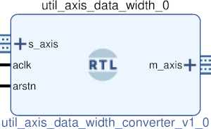

# AXIS STRING TO AXIS DATA
## Converts incoming axis string into axis data.
---

   author: Jay Convertino   
   
   date: 2023.01.01  
   
   details: Converts incoming axis string into axis data..  
   
   license: MIT   
   
---

### Dependencies
#### Build

  - AFRL:utility:helper:1.0.0
  
#### Simulation

  - AFRL:simulation:axis_stimulator
  - AFRL:simulation:clock_stimulator

### IP USAGE
#### INSTRUCTIONS

This core takes a incoming string, removes the delimiters, terminators, and prefixs.  
After this all HEX value characters are converted into there binary values and output  
to the ports specified by the prefix.

#### PARAMETERS

* DELIMITER   : DEFAULT : ";"   : break value between multple strings  
* STRING_LEN  : DEFAULT : 4     : max lenth of string including delimiter  
* TERMINATION : DEFAULT : "\n"  : termination value of full string from serial port, byte only. (\n DEFAULT : 0A \r DEFAULT : 0D).  
* SBUS_WIDTH  : DEFAULT : 1     : bus width of master (data) output  
* USER_WIDTH  : DEFAULT : 4     : user width of master bus, only in 4 bit nibbles and at least 4 bits.  
* DEST_WIDTH  : DEFAULT : 4     : dest width of master bus, only in 4 bit nibbles and at least 4 bits.  
* PREFIX_LEN  : DEFAULT : 1     : length of following prefix strings.  
* DATA_PREFIX : DEFAULT : "#"   : prefix for data hex strings  
* DEST_PREFIX : DEFAULT : "&"   : prefix for destination hex strings  
* USER_PREFIX : DEFAULT : "*"   : prefix for user hex strings  
* KEYWORD_LEN : DEFAULT :  3    : length of the following keywords  
* SET_KEYWORD : DEFAULT : "set" : keyword to output data over tdata,tuser,tdest on master interface.  
* CLR_KEYWORD : DEFAULT : "clr" : keyword to clear output data and buffers of master interface.  

### COMPONENTS
#### SRC

* axis_string_to_axis_data.v
  
#### TB

* tb_axis.v
* in.bin
  
### fusesoc

* fusesoc_info.core created.
* Simulation uses icarus to run data through the core.
